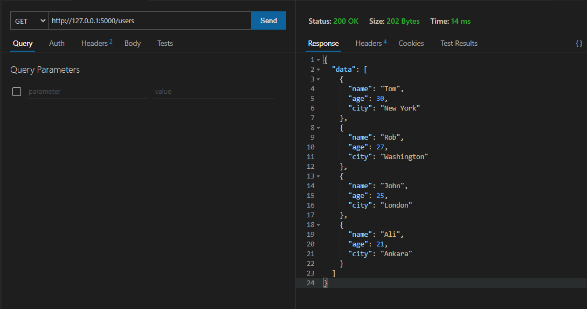
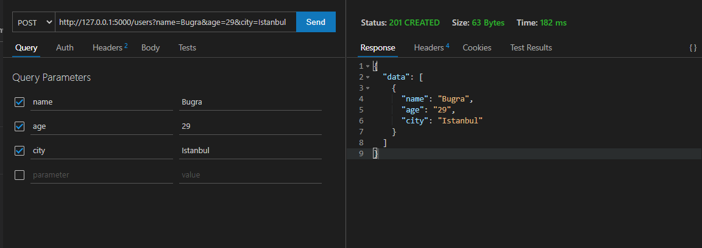
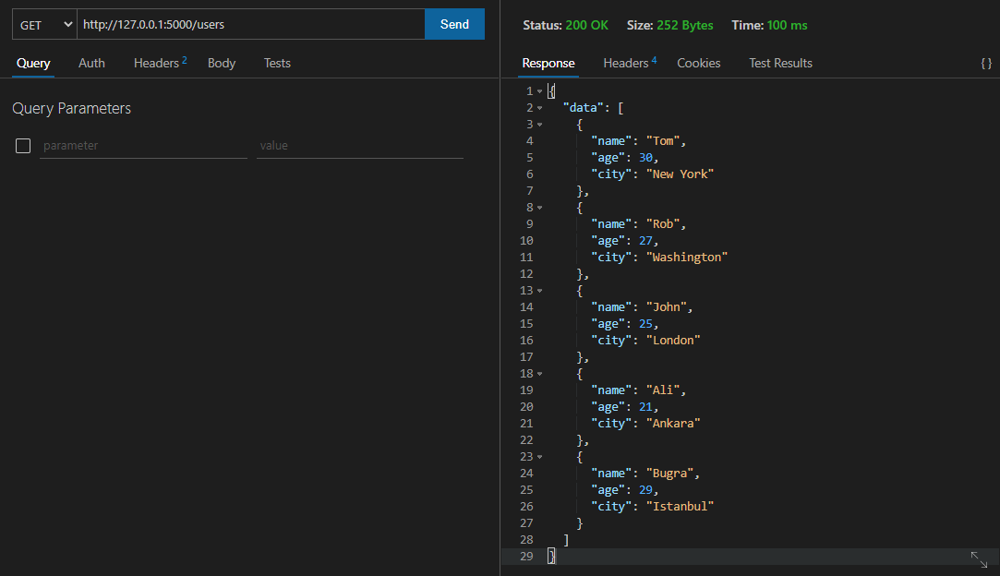

# REST API Nedir ?

REST  (**R**epresentational **S**tate **T**ransfer)  Temsili Durum Aktarımı anlamına gelir. 

Bir istemci bir sunucudan kaynaklar hakkında bilgi almak için bir istekte bulunduğunda, sunucu kaynağın mevcut durumunu istemci makineye geri aktarır.


Yukarıdaki şekilde de görebilceğiniz gibi , istemci bir veri tabanı sunucusundan veri talep edebileceğiniz PC'nizdir ve tüm iletişim REST API'leri üzerinden yapılır.

Bunun için de birkaç farklı yöntem vardır :

- **GET** - İstemci tarafından sunucudan veri seçmek veya almak için kullanılır.

- **POST** - İstemci tarafından sunucuya veri göndermek veya yazmak için kullanılır.

- **PUT** - İstemci tarafından sunucudaki mevcut verileri güncellemek için kullanılır.

- **DELETE** - İstemci tarafından sunucudaki mevcut verileri silmek için kullanılır.

  

# REST API Nasıl Oluşturulur ?

API'ler Java, C#, Python vb. gibi istediğiniz herhangi bir programlama dili kullanılarak oluşturulabilir.

 Bu uygulamada, bir API oluşturmak için Python'u kullanacağız ve bunun için Flask olarak bilinen bir kütüphaneden yararlanacağız. Flask, bizim için bir sunucu oluşturmak için ağır kaldırmanın çoğunu yapan popüler bir hafif web uygulaması geliştirme çerçevesidir ve geliştiriciler olarak yalnızca API'leri oluşturmak için iş mantığına odaklanmamız gerekir.


# Kurulum

Şimdi, Rest-API'yi oluşturmak için kullanacağımız flask, flask_restful ve veri işlemede kullanacağımız pandas paketlerini python3-pip ile kuralım.

```
$ sudo apt install python3-pip
```

```
$ pip3 install flask
```

```
$ pip3 install flask_restful
```

```
$ pip3 install pandas
```

# Kod

Gerekli paketlerin import edilmesi.
```
from flask import Flask
from flask_restful import Api, Resource, reqparse
import pandas as pd
```
Api nesnesinin oluşturulması.
```
app = Flask(__name__)
api = Api(app)
```
GET çağırıldığında users.csv okunması, dict formatına çevrilmesi ve döndürülmesi.
```
class Users(Resource):
    def get(self):
        data = pd.read_csv('users.csv')
        data = data.to_dict('records')
        return {'data' : data}, 200
```
POST çağırıldığında girdilerin parse edilmesi ve users.csv'ye bir satır eklenmesi.
```
    def post(self):
        parser = reqparse.RequestParser()
        parser.add_argument('name', required=True)
        parser.add_argument('age', required=True)
        parser.add_argument('city', required=True)
        args = parser.parse_args()

        data = pd.read_csv('users.csv')

        new_data = pd.DataFrame({
            'name'      : [args['name']],
            'age'       : [args['age']],
            'city'      : [args['city']]
        })

        data = data.append(new_data, ignore_index = True)
        data.to_csv('users.csv', index=False)
        return {'data' : new_data.to_dict('records')}, 201
```

Çoğu zaman bir API'de kaynağınızın birden çok URL'si olacaktır. Api nesnesindeki add_resource() fonksiyonu ile birden çok URL iletebilirsiniz. Her biri bir Resource'a yönlendirilecektir.
```
api.add_resource(Users, '/users')
```


# Çalıştırma

```
$ python3 flask_app.py 

Serving Flask app 'flask_app' (lazy loading)

Environment: production
WARNING: This is a development server. Do not use it in a production deployment.
Use a production WSGI server instead.

Debug mode: off

Running on http://127.0.0.1:5000/ (Press CTRL+C to quit)
```

```GET http://127.0.0.1:5000/users```


```POST http://127.0.0.1:5000/users?name=Bugra&age=29&city=Istanbul```


```GET http://127.0.0.1:5000/users```


```GET http://127.0.0.1:5000/Tom```


*Ali Buğra Okkalı  
HAVELSAN - 2021*
